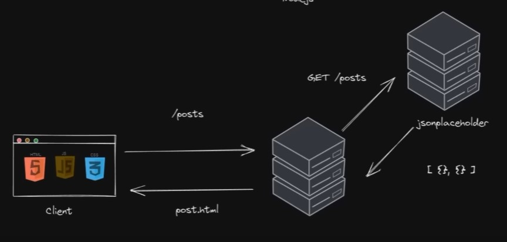

# Base de datos

## async code

Node nos permite consultar datos de otro servido o bases de datos, para esto se necesita modulos externos ejemplo axios, tambien puedes utilizar fetch.

```javascript
npm i axios
```



El siguiente codigo realiza la consulta en otro servidor (_placeholder_)

```javascript
const { Router } = require("express");
const axios = require("axios");

const router = Router();

router.get("/posts", async (req, res) => {
  const response = await axios.get(
    "https://jsonplaceholder.typicode.com/posts"
  );
  //console.log(response.data);
  res.render("posts", {
    posts: response.data,
  });
});

module.exports = router;
```

Los datos traidos desde servido (placeholder) se convierte en un formato _ejs_. en nuestro servidor y se presenta al cliente en un archivo _HTML_

```html
<%- include('partials/header'); %>

<h1>Posts</h1>
<% for(let i = 0; i < posts.length; i++) { %>

<article>
  <h1><%=posts[i].title %></h1>
  <p><%=posts[i].body %></p>
</article>

<% } %>
<h3>Fin</h3>
<%- include('partials/footer'); %>
```

## Bases de Datos

Vamos a realizas una conexion a una base de datos mysql (relacional) y utilizar el modulo mysql

```javascript
npm i mysql2
```

db.js

```javascript
const mysql = require("mysql2/promise");

async function connectDB() {
  const connection = await mysql.createConnection({
    host: "us-east.connect.psdb.cloud",
    user: "xrolj2z57yivxyiijm6g",
    password: "secret_password",
    database: "expressframework",
    ssl: {
      rejectUnauthorized: false,
    },
  });

  const result = await connection.query('SELECT "Hello World" AS Result');
  console.log(result);
}

module.exports = connectDB;
```

Se coloca antes comenzar la aplicación

```javascript
const connectDB = require("./db");

connectDB();
```
