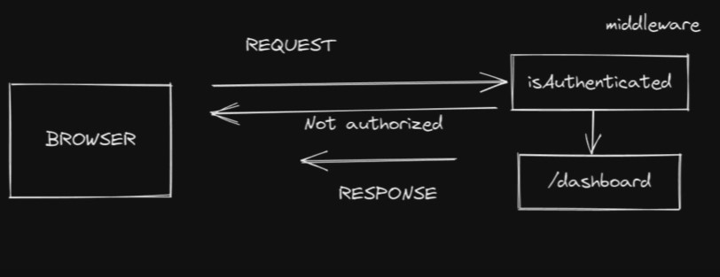

# Conceptos Principales

## Request Body

Cuando enviamos datos al servidor **request**, realmente se envia un documento que tiene un titulo (ejemplo la url), este documeto tiene un contenido que puede ser un objeto **json** y tambien se envia una cabecera (_header_) para dar informacion del contenido que estoy enviando. (formato del contenido ejemplo json y el estado - 200).

Esta estructura se le conoce con requeste body, esta estructura tambien aplica cuando tenemos respuesta (_response_) del servidor


- **endpoint** la ruta
- **header** formato de la información y le estado
- **body** el contenido de la información

```javascript
const express = require("express");

const app = express();

app.use(express.text()); // enviamos un texto
app.use(express.json()); // enviamos un json
app.use(express.urlencoded({ extended: false }));
//enviamos un formulario

app.post("/user", (req, res) => {
  console.log(req.body);
  res.send("Nuevo usuario creado");
});

app.listen(3000);
console.log(`server on port ${3000}`);
```

## Request Params

Se llama parametros a los valores que pueden ir cambiando, suele ir representado en las rutas con 2 puntos(:) para indicar que es un parametro.

Los parametro tiene las mismas propiedades de las variables en JavaScript.

```javascript
const express = require("express");

const app = express();

app.get("/hello/:username", (req, res) => {
  //console.log(req.params.username);
  console.log(typeof req.params.username);
  res.send(`hello ${req.params.username.toUpperCase()}`);
});

app.get("/add/:x/:y", (req, res) => {
  const { x, y } = req.params;
  res.send(`Result: ${parseInt(x) + parseInt(y)} `);
});

app.get("/users/:username/photo", (req, res) => {
  console.log(req.params);
  if (req.params.username === "fazt") {
    return res.sendFile("./img/Javascript.png", {
      root: __dirname,
    });
  }
  res.send("el usario no tiene acceso");
});

app.get("/name/:name/age/:age", (req, res) => {
  console.log(req.params);
  res.send(`El usuario ${req.params.name} tiene ${req.params.age} años`);
});

app.listen(3000);
console.log(`server on port ${3000}`);
```

## Queries

Las queires se utiliza para enviar informacion en las urls. se utiliza el signo de interrogacion (**?**) para enviar la información, se puede enviar una o varias variables. para enviar mas de una variables se utiliza el signo ampersand (**&**)

- Se puede combinar los parametros y queries

```javascript
app.get("/search", (req, res) => {
  console.log(req.query);
  if (req.query.q === "javascript books") {
    res.send("lista de libros de javascript");
  } else {
    res.send("pagina normal");
  }
});
//URL
//http://localhost:3000/search?q=javascript%20books
//http://localhost:3000/search?user=andrey&user=marcos&user=mateo
```

## Método All

El método **ALL** puede ser cualquiera de los métodos http (_get_, _post_, _put_, _delete_ y _patch_).

```javascript
app.all("/info", (req, res) => {
  res.send("server info");
});
```

## Middlewares

Un middleware es una función que se puede ejecutar antes o después del manejo de una ruta. Esta función tiene acceso al objeto **Request**, **Response** y la función next().

Las funciones middleware suelen ser utilizadas como mecanismo para verificar niveles de acceso antes de entrar en una ruta, manejo de errores, validación de datos, etc.

La siguiente imagen es la representa de un proceso de autenticacion a una pagina web



```javascript
const express = require("express");

const app = express();

app.use((req, res, next) => {
  console.log(`Route: ${req.url} Methodo: ${req.method}`);
  next();
});

app.get("/profile", (req, res) => {
  res.send("profile page");
});

app.all("/about", (req, res) => {
  res.send("about page");
});

app.use((req, res, next) => {
  if (req.query.login === "fazt@faztweb.com") {
    next();
  } else {
    res.send("No autorizado");
  }
});

app.get("/dashboard", (req, res) => {
  res.send("Dashboard Page");
});

app.listen(3000);
console.log(`server on port ${3000}`);
```

Las funciones middleware son muy importantes en una aplicación de de Express js porque con ellas se pueden realizar validaciones, gestionar errores, sin la necesidad de llegar hasta la definición de las rutas. Por lo tanto es indispensable aprender a utilizarlas.

### middlewares populares

- Morgan

```javascript
app.use(express.json());
app.use(morgan("dev"));

app.get("/profile", (req, res) => {
  console.log(req.body);
  res.send("profile page");
});

app.all("/about", (req, res) => {
  res.send("about page");
});
```
