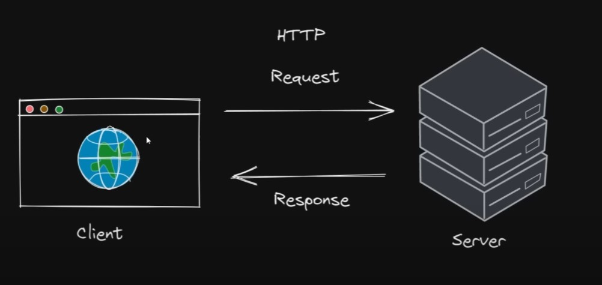
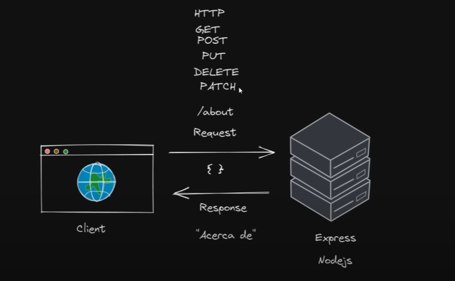

# Express framework de node.js

## Instalación

1. Intalar node.js
2. Instalar express

```node.js
npm i express
```

## Modulo Cliente/Servidor



### Cliente (Frontend)

Es todo el desarrollo de la interfaz grafica (frontend) que se puede desarrollar con un framework de javascript (Vue, React, Angular, Svelte)

### Servidor (Backend)

El servido se puede crear con multi-lenguaje de programación (python, node.js, java, php).

## HTTP vs Express

### HTTP

```javascript
const http = require("http");
const fs = require("fs");

const server = http.createServer((req, res) => {
  const read = fs.createReadStream("./static/index.html");
  read.pipe(res);
});

server.listen(3000);
console.log(`server on port ${3000}`);
```

### Express

Con el metodo **get** se puede generar diferentes rutas dentro una pagina web.

```javascript
const express = require("express");

const app = express();
app.get("/", (req, res) => {
  res.sendFile("./static/index.html", {
    root: __dirname,
  });
});

app.listen(3000);
console.log(`server on port ${3000}`);
```

## Rutas

```javascript
const express = require("express");

const app = express();

app.get("/", (req, res) => {
  res.send("Hello World");
});

app.get("/About", (req, res) => {
  res.send("About");
});

app.get("/Weather", (req, res) => {
  res.send("The current weather is Nice");
});

app.use((req, res) => {
  res.status(404).send("No found page");
});

app.listen(3000);
console.log(`server on port ${3000}`);
```

## Metodos de http

- GET (leer o obtner un dato del servidor).
- POST (Guardar un dato en el servidor).
- PUT (Actualizar un dato desde el servidor).
- DELETE (Eliminar un dato del servidor).
- PATCH (Es similar a PUT, la diferencia que actualiza un porción de un dato en el servidor).

Los metodos **GET**, **POST**, **PUT**, **DELETE** y **PATCH** se les conoce como verbos **http**



## Metodos de http en express

Con la extensión **Thunder Client** en Visual Studio Code se puede probar cada uno de los métodos http.

```javascript
const express = require("express");

const app = express();

app.get("/products", (req, res) => {
  //Validate data
  // query a database
  // process data
  res.send("Listas de productos");
});

app.post("/products", (req, res) => {
  res.send("Creando productos");
});

app.put("/products", (req, res) => {
  res.send("Actualizando un producto");
});

app.delete("/products", (req, res) => {
  res.send("Eliminando un producto");
});

app.patch("/products", (req, res) => {
  res.send("Actualizando una parte del producto");
});

app.listen(3000);
console.log(`server on port ${3000}`);
```

## Respuestas de http

Las respuesta de hhtp son las respuesta del servidor

- send (nos permite obtener texto).
- sendFile (nos permite obtener archivos ejemplo: imagen, video y etc)
- json ( nos permite obtener archivos tipo json)
- sendStatus ( nos permite obtener un codigo de estado no hay contenido)

```javascript
const express = require("express");

const app = express();

app.get("/", (req, res) => {
  res.send("Hello World");
});

app.get("/miarchivo", (req, res) => {
  res.sendFile("./img/Javascript.png", {
    root: __dirname,
  });
});

app.get("/user", (req, res) => {
  res.json({
    name: "Fazt",
    lastName: "ray",
    age: 40,
    points: [1, 2, 3],
    adress: {
      city: "new york",
      street: "some steet 123",
    },
  });
});

app.get("/isalive", (req, res) => {
  res.sendStatus(204);
});

app.listen(3000);
console.log(`server on port ${3000}`);
```
