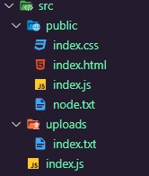

# RestAPI

## RESTAPI (GET-POST-PUT-DELETE)

```javascript
const express = require("express");
const morgan = require("morgan");

const app = express();
let products = [
  {
    id: 1,
    name: "laptop",
    price: 300,
  },
];

app.use(morgan("dev"));
app.use(express.json());

app.get("/products", (req, res) => {
  res.json(products);
});

app.post("/products", (req, res) => {
  const newProduct = { ...req.body, id: products.length + 1 };
  products.push(newProduct);
  res.send(newProduct);
});

app.put("/products/:id", (req, res) => {
  const newData = req.body;
  const productFound = products.find(
    (product) => product.id === parseInt(req.params.id)
  );
  if (!productFound)
    return res.status(400).json({
      message: "product not found",
    });
  products = products.map((p) =>
    p.id === parseInt(req.params.id) ? { ...p, ...newData } : p
  );
  res.json({
    message: "Product update successfully",
  });
});

app.delete("/products/:id", (req, res) => {
  const productFound = products.find(
    (product) => product.id === parseInt(req.params.id)
  );
  if (!productFound)
    return res.status(400).json({
      message: "product not found",
    });
  products = products.filter((p) => p.id !== parseInt(req.params.id));
  res.sendStatus(204);
});

app.get("/products/:id", (req, res) => {
  const productFound = products.find(
    (product) => product.id === parseInt(req.params.id)
  );
  if (!productFound)
    return res.status(400).json({
      message: "product not found",
    });
  res.json(productFound);
});

app.listen(3000);
console.log(`server on port ${3000}`);
```

## Setting

### Orden de servidor node.js

- settings
- middlewares
- routing

```javascript
//settings
app.set("appName", "Express Course");
app.set("port", 3000);
app.set("case sensitive routing", true);

//middlewares
app.use(express.json());
app.use(morgan("dev"));

//routes
app.get("/UserName", (req, res) => {
  res.send("Username Route");

app.listen(app.get("port"));
console.log(`Server ${app.get("appName")} on port ${app.get("port")}`);
```

## Static Files

En secciones anteriores el metodo **sendFile** nos permitia enviar un archivo como respuesta, si necesitamos enviar mas de un archivo el metodo nos es el apropiado. Los archivos estaticos nos permite acceder por carpetas desde la url del navegador. como se puede ver en la configuracion de carpetas.



En el siguiente codigo es un ejemplo como acceder a los archivos estaticos. El método path nos permite unir directorios de manera sencilla.

**Nota 1**: Los archivos estatico generalmente van al final del codigo despues de las rutas principales.

**Paquete path**: Nos sirve para concatenar directorios (carpetas).

```javascript
const express = require("express");
const morgan = require("morgan");
const path = require("path");

//Settings
app.set("appName", "Express Course");
app.set("port", 3000);
app.set("case sensitive routing", true);

//Middlewares
app.use("/public", express.static(path.join(__dirname, "public")));
app.use("/uploads", express.static(path.join(__dirname, "uploads")));

// app.use("/public", express.static("./public"));
// app.use("/uploads", express.static("./uploads"));

app.listen(app.get("port"));
console.log(`Server ${app.get("appName")} on port ${app.get("port")}`);
```

## Express Router

Nos permite dividir las rutas de la aplicacion en diferentes archivos, podemos ver el siguiente ejemplo donde se diver las rutas entre **home** y **user**

```javascript
//USER
const { Router } = require("express");

const router = Router();

router.get("/UserName", (req, res) => {
  res.send("Username Route");
});

router.get("/profile", (req, res) => {
  console.log(req.body);
  res.send("profile page");
});

module.exports = router;

//HOME
const { Router } = require("express");

const router = Router();

router.all("/about", (req, res) => {
  res.send("about page");
});

router.get("/dashboard", (req, res) => {
  res.send("Dashboard Page");
});

module.exports = router;
```

El archivo principal queda mas organizado, se llama cada uno de los archivo y guarda en una variable **HomeRoutes** y **UserRoutes**, las rutas se llama como middleware.

```javascript
const express = require("express");
const morgan = require("morgan");
const path = require("path");

const app = express();

const HomeRoutes = require("./routes/home");
const UserRoutes = require("./routes/users");

//settings
app.set("appName", "Express Course");
app.set("port", 3000);
app.set("case sensitive routing", true);

//middlewares
app.use(express.json());
app.use(morgan("dev"));

app.use(HomeRoutes);
app.use(UserRoutes);

//routes
app.use("/public", express.static(path.join(__dirname, "public")));
app.use("/uploads", express.static(path.join(__dirname, "uploads")));

app.listen(app.get("port"));
console.log(`Server ${app.get("appName")} on port ${app.get("port")}`);
```
