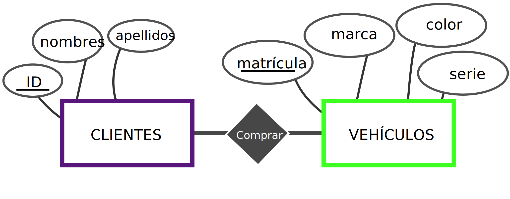

# 7. Modelo Entidad-Relacion

Un Modelo Entidad-Relación (ER) es un método para representar estructuras de datos y sus relaciones en bases de datos. Fue desarrollado por Peter Chen en 1976 y es una herramienta esencial en el diseño de bases de datos, especialmente en el diseño de bases de datos relacionales. Aquí están los componentes clave de un Modelo Entidad-Relación:

1. **Entidades**: Son objetos o conceptos que son importantes para el sistema que se está modelando. Por ejemplo, en una base de datos de una universidad, las entidades podrían ser "Estudiantes", "Profesores" y "Cursos". Las entidades se representan generalmente como rectángulos en un diagrama ER.
2. **Atributos**: Son las propiedades o características de una entidad. Por ejemplo, la entidad "Estudiante" podría tener atributos como "ID del Estudiante", "Nombre" y "Edad". Los atributos se representan como óvalos y se conectan a su entidad correspondiente.
3. **Relaciones**: Indican cómo se relacionan las entidades entre sí. Por ejemplo, una relación podría ser "está matriculado en" entre "Estudiantes" y "Cursos". Las relaciones se representan con líneas que conectan las entidades, y a menudo tienen etiquetas para describir la naturaleza de la relación.
4. **Cardinalidad**: Define la naturaleza cuantitativa de las relaciones, es decir, indica cuántas instancias de una entidad pueden estar asociadas con instancias de otra entidad. Los tipos comunes de cardinalidad son uno a uno, uno a muchos y muchos a muchos.

El Modelo ER ayuda a visualizar la estructura de datos y las relaciones entre los datos en un nivel alto y abstracto, facilitando el diseño y la comprensión de bases de datos complejas. Es una herramienta fundamental en el proceso de diseño de bases de datos, ya que ayuda a identificar las entidades clave y cómo se conectan entre sí, asegurando que los datos se organicen de manera lógica y eficiente.

